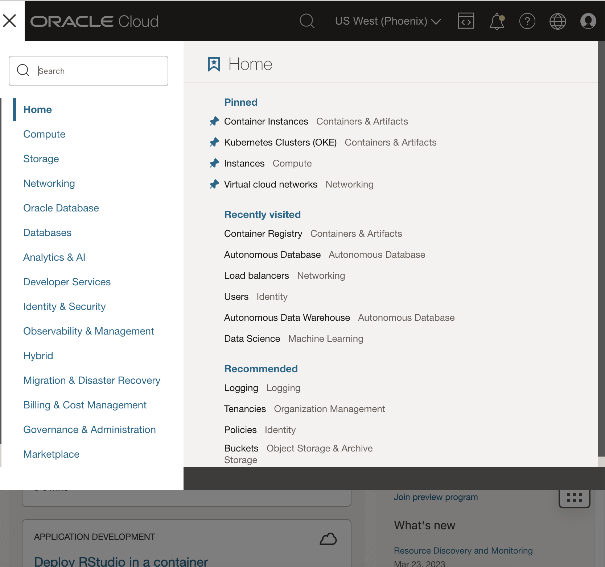
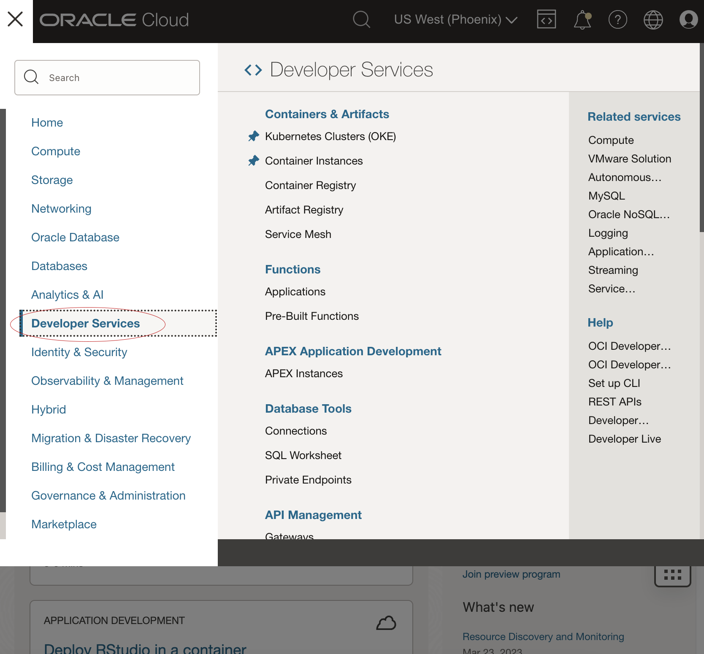
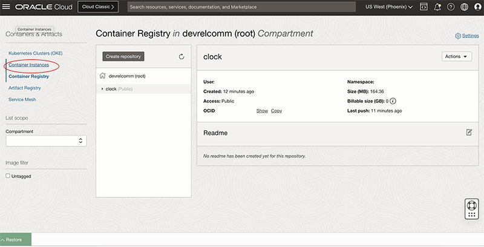
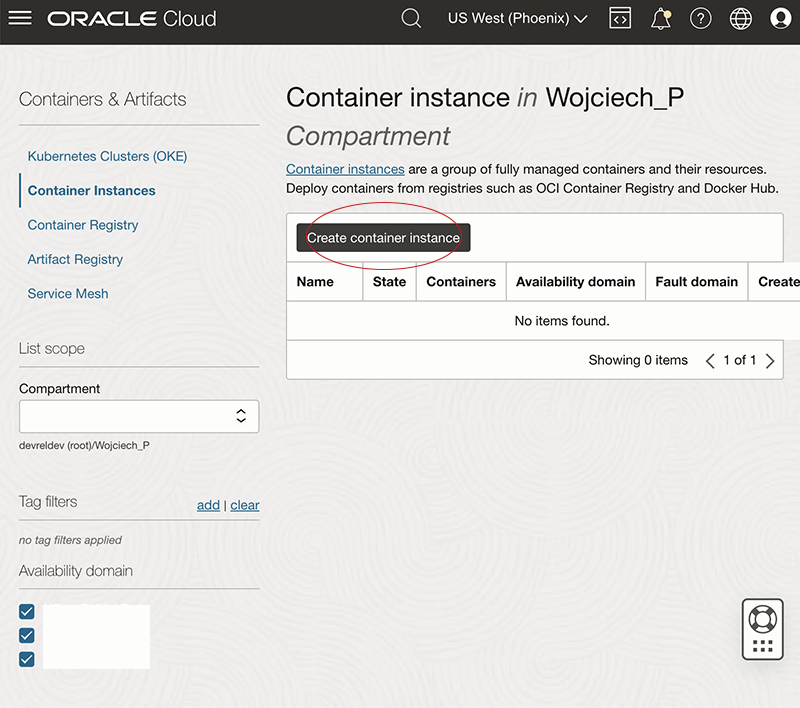
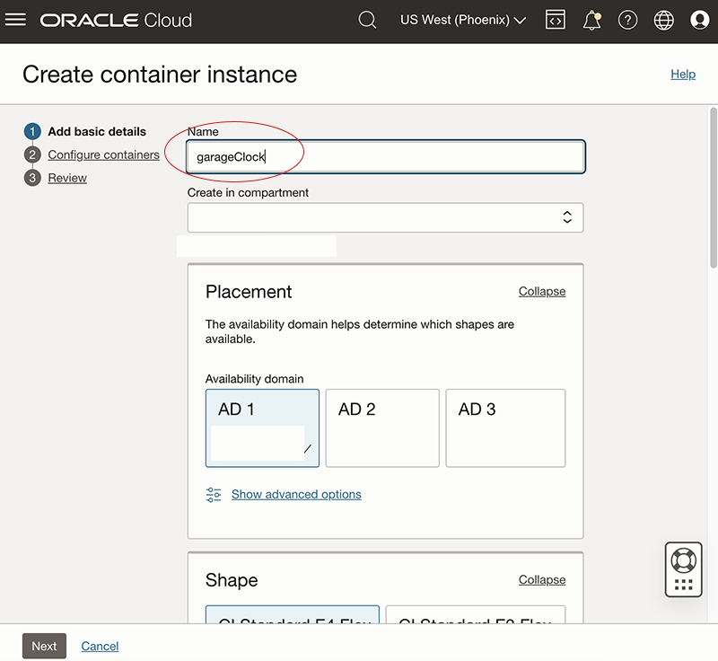
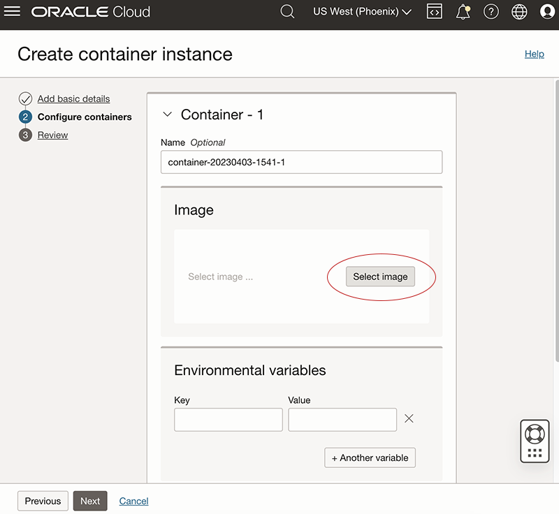
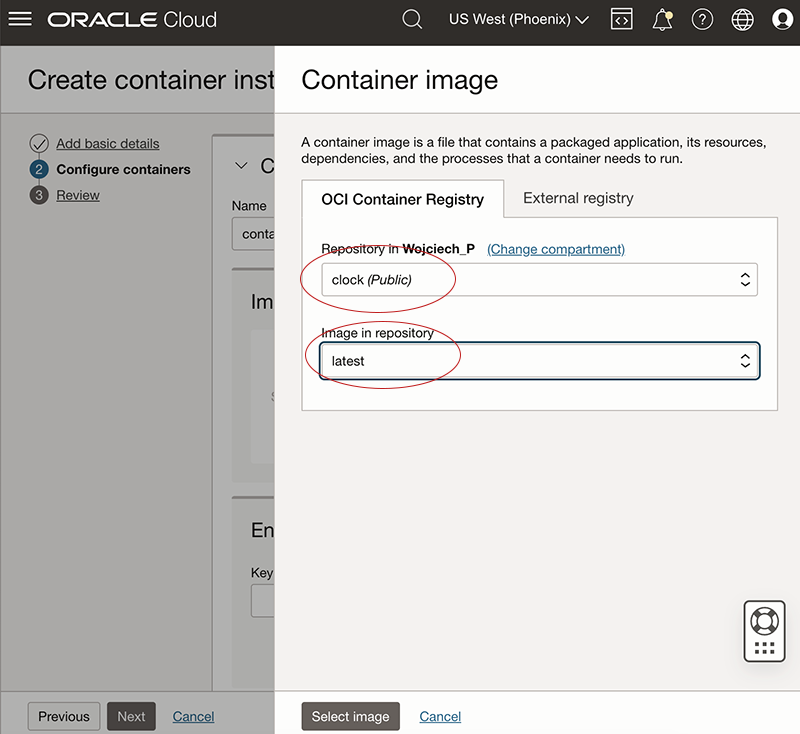
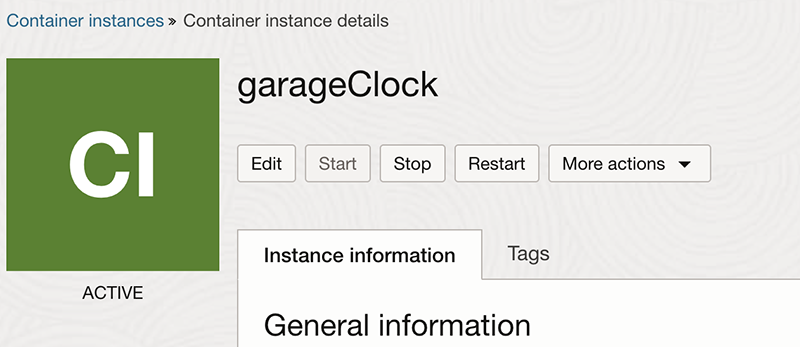

# Garage Clock

## Deploy Oracle JET app to the Container Instances
  

### Compile and push your image  
- Login to your account on cloud.oracle.com  
- Open Cloud Shell  
- Clone this repository with following command (TODO)  
        `git clone -b CI https://github.com/WSPluta/f1countDownTimer.git`
- Open your freshly cloned repository:  
        `cd garageClock`  
- Create docker container:   
        `docker build -t clock .`  
- Generate auth token:  
        `oci iam auth-token create --description "DEFAULT" --user-id <paste user OCID> --query 'data.token' --raw-output`  
- Echo your _namespace_:  
        `oci os ns get -c $OCI_TENANCY --query 'data' --raw-output`  
- Login to your container registry - replace with xxx with your region  
        `docker login <paste yoy region>.ocir.io`  
- Input your details  
        Username:   
        Password: `<paste auth token>`
- Tag your container:  
        `docker tag clock:latest <paste yoy region>.ocir.io/<paste namespace>/clock:latest`  
- Push your image to the Container Registry:  
        `docker push <paste yoy region>.ocir.io/<paste namespace>/clock:latest`

### Deploy Container Instance
We will deploy our app using UI, but you can do with Cloud Shell too.
- Click on _hamburger menu_   
          
- Click on _Developer Services_
          
- Click on _Container Instances_
          
- Click on _Create container instance_
          
- Add _Name_, choose _Compartment_, _Availability domain_, _Shape_, _Virtual cloud network_ and _Subnet_ ( we need to have TCP port 80 opened )
          
- Click _Next_
- In Image section click on _Select image_
          
- Click on _Choose repository_ and select your container - if you cant find you image try changing the compartment to root
- Pick _Image in repository_, in our case it is latest since this is how we tagged it in our docker push command
          
- Click on _Select image_
- Click _Next_
- Check your settings and click _Create_
- Wait for your app to deploy
- Once ready you can copy and paste public IP in your browser and voila your Container Instance is up and running
          

## Install
1. For Development use homebrew or similar package manager to install Oracle JET `brew install --cask jet`
1. Install Nodejs (latest LTS release would be recommended) From a terminal or command line window.
2. Globally install http-server NPM module.  `npm -g install http-server`
3. Unzip the countdown app into some empty folder
4. From the root of that countdown app folder, `run http-server -o`  (that's a lower case o, not zero)

## Run app for local development
1. From root folder run `ojet restore` to install environment
2. To start app run `ojet serve`

## Package
3. To distribute app run `ojet build --release`

### ojet restore help
	Command details:

    restore .............................. Restores missing dependencies, plugins, and libraries to a JET app

         [app] ........................... Restores missing dependencies, plugins, and libraries to a JET app

            --secure ..................... Whether to enforce secure HTTPS protocol
                                           Value: [true|false]
                                           Default: true
            --username | u ............... The user's registered username
            --password | p ............... The user's registered password
            --ci ......................... Use npm ci instead of npm install
                                           Default: false

Examples:

    ojet restore
    ojet restore app

### ojet serve synopsis:

    ojet serve [<scope>] [<parameter>] [<options>]

Command details:

    serve | s ............................ Serves a JET app to an emulator, device or the browser

         [app] ........................... Serves a JET app for the specified platform
                                           Parameter: [android|ios|windows|web]

            --release | r ................ Serve in release mode
                                           Value: [true|false]
            --optimize ................... Specify rjs optimize value
                                           Value: <string>
            --build-config ............... Specify the build config file for signing the hybrid app
                                           Value: <build_config_file>
            --build ...................... Build the app before serving it
                                           Value: [true|false](--no-build)
                                           Default: true
            --sass ....................... Enable SASS compilation and SASS watch 
                                           Value: [true|false](--no-sass)
                                           Default: true
            --server-port ................ Specify the server port
                                           Value: <integer>
                                           Default: 8000
            --svg ........................ Enable SVG re-compilation for JET Alta Theme
                                           Value: [true|false]
                                           Default: false
            --theme ...................... Specify the theme to be used by the app,
                                           -> alta themes are platform specific
                                           -> redwood theme is for all platforms
                                           Value: <theme_name>[:<platform>]

### ojet build synopsis:

    ojet build [<scope>] [<parameter>] [<options>]

Command details:

    build | b ............................ Builds a JET app

         [app] ........................... Builds a JET app for the specified platform,
                                           where [app] is the directory context of the JET app.
                                           
                                           Parameter: [android|ios|windows|web] - specifies the build platform
                                           The default platform is 'web'

            --release | r ................ Build in release mode
                                           Value: [true|false]
            --optimize ................... Specify rjs optimize value
                                           Value: <string>
            --build-config ............... Specify the build config file for signing the hybrid app
                                           Value: <build_config_file>
            --sass ....................... Enable SASS compilation
                                           Value: [true|false](--no-sass)
                                           Default: true
            --svg ........................ Enable SVG re-compilation for JET Alta Theme
                                           Value: [true|false]
                                           Default: false
            --theme ...................... Specify the theme to be used by the app,
                                           -> alta themes are platform specific
                                           -> redwood theme is for all platforms
                                           Value: <theme_name>[:<platform>]
                                           where <theme_name> is: alta or <custom_theme_name>
                                           and <platform> is one of: android, ios, web, windows
                                           Default: redwood for web platform
            --themes ..................... Specify multiple themes separated by comma(s)
                                           When the --theme flag is missing,
                                           the first element in the --themes flag is identified as the default theme.
            --cssvars .................... Specify to inject css file which supports css custom properties
                                           When the --cssvars flag is missing,
                                           the default css preprocessor has been used to process away the custom properties.
                                           Value: [enabled|disabled]
                                           Default: disabled
            --user-options ............... Specify user-defined options - these are accessible in hooks config object
                                           Value: <string>

            Hybrid only:

            --destination ................ Specify the destination for building the app
                                           Value: device|emulator
                                           Default: emulator
            --device ..................... Shortcut for --destination=device
            --emulator ................... Shortcut for --destination=emulator
            --platform-options ........... Specify platform specific options that are passed to the Cordova command line
                                           Value: <platform_specific_options>
                                           Use quotes to pass multiple options as a single parameter value

         component ....................... Builds an optimized component for the specified component name
                                           Use ojet build component component_name to build an optimized component
                                           Parameter: component name

         pack ............................ Builds an optimized pack for the specified pack name
                                           Use ojet build pack pack_name to build an optimized pack
                                           Parameter: pack name

Examples:

    ojet build
    ojet build --cssvars=enabled
    ojet build ios --no-sass
    ojet build android --release
    ojet build ios --device --build-config=./buildConfig.json --theme=myCustomTheme
    ojet build web --theme=alta:android
    ojet build windows --platform-options="--archs=\"x86 x64 arm\""
    ojet build --user-options="arbitrary string" // provide user-defined options
    ojet build --release --optimize=none // Build a release with readable output. Useful for debugging
    ojet build component demo-card // component build
    ojet build pack demo-card-pack // pack build

## Manage app

